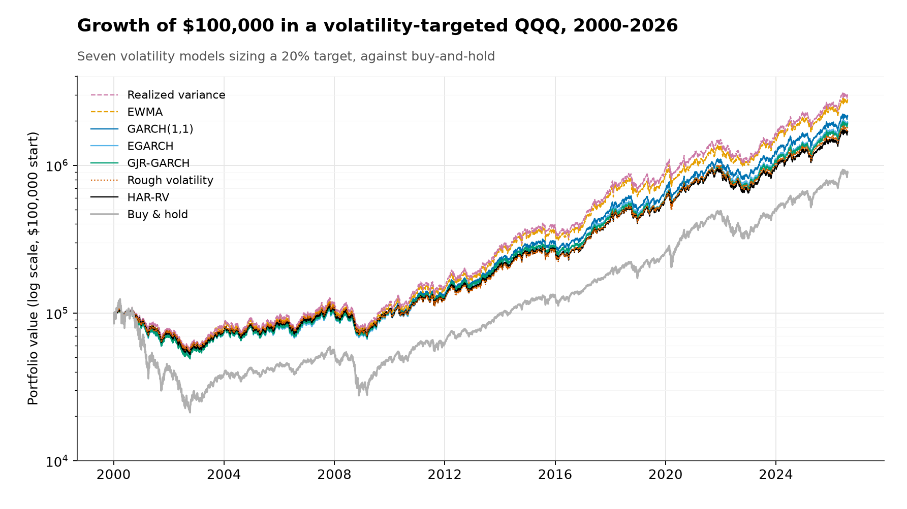

# Does the volatility model matter for a volatility-targeted QQQ?

The strategy holds QQQ at a weight that targets 20% annualized volatility,
`w = clip(0.20 / √(252 · V̂), 0, 2)`, rebalanced monthly, where `V̂` is a 21-day-ahead
variance forecast. Seven models compete to supply that forecast, namely GARCH(1,1), EGARCH, GJR-GARCH,
EWMA, trailing realized variance, HAR-RV, and rough volatility. The question is whether the choice
among them changes anything, either the accuracy of the forecast or the portfolio it produces, on QQQ
from 2000 through 2026.



## Performance

Sized to the same 20% target, the seven models grow $100,000 into $1.6M to $3.1M over the full
history. Buy-and-hold reaches $0.93M at nearly 27% volatility, with an 83% peak-to-trough loss in the
2000-2002 selloff. Two static benchmarks that fix the position without a live forecast reach under
$0.70M. Resizing with a volatility forecast holds realized volatility near the target and roughly
halves the maximum drawdown, and over the full sample it lifts the Sharpe ratio from 0.37 to the 0.54
to 0.60 range.

| Strategy | CAGR | Ann. volatility | Sharpe | Max drawdown | Calmar | Final value of $100k |
|:--|:-:|:-:|:-:|:-:|:-:|:-:|
| GARCH(1,1) | 12.2% | 20.6% | 0.57 | -54% | 0.23 | $2.21M |
| EGARCH | 11.8% | 20.7% | 0.55 | -55% | 0.22 | $2.01M |
| GJR-GARCH | 11.7% | 20.2% | 0.55 | -55% | 0.21 | $1.96M |
| EWMA | 13.3% | 22.3% | 0.58 | -50% | 0.26 | $2.82M |
| Realized variance | 13.7% | 22.3% | 0.60 | -49% | 0.28 | $3.08M |
| HAR-RV | 11.2% | 19.9% | 0.54 | -53% | 0.21 | $1.73M |
| Rough volatility | 11.4% | 20.2% | 0.54 | -51% | 0.22 | $1.82M |
| Buy & hold | 8.6% | 26.8% | 0.37 | -83% | 0.10 | $928K |
| Constant leverage | 7.5% | 19.8% | 0.36 | -71% | 0.10 | $697K |
| Unconditional vol | 7.4% | 19.5% | 0.36 | -70% | 0.11 | $688K |

The seven models sit close together and well ahead of the benchmarks over the full history, but two
things temper that. The full-sample Sharpe gap over buy-and-hold rests heavily on the 2000-2002 crash
and shrinks in later windows, as the next section shows. And the highest Sharpe ratios belong to the
two simplest forecasters, realized variance and EWMA, which comes from volatility timing, not
forecasting skill. Full statistics, including target-adherence error and drawdown
duration, are in [`outputs/tables/portfolio_summary.csv`](outputs/tables/portfolio_summary.csv).

## Robustness across subsamples

A 2000 start begins at the dot-com peak, which flatters any strategy that cuts equity exposure. The
tables below repeat the statistics over two later windows to see how much of the edge depends on that
one crash. A 2003 start drops the dot-com collapse but keeps 2008; a 2010 start drops both.

Buy-and-hold's own Sharpe ratio climbs from 0.37 on the full sample to 0.72 from 2003 and 0.87 from
2010. The models climb too, but by less, so their risk-adjusted advantage over buy-and-hold narrows
from about 0.20 on the full sample to roughly 0.05 from 2003 and to a few hundredths from 2010, where
several models sit at or below buy-and-hold. What holds up in every window is the drawdown reduction
(the models lose 39-41% from 2003 and 27-32% from 2010, against 53% and 35% for buy-and-hold) and the
near-equivalence of the seven models to one another. Read together, volatility targeting on QQQ mainly
bought drawdown protection; its risk-adjusted return advantage over buy-and-hold was concentrated in
the crash that happened to begin at the sample's start.

**From 2003** (keeps 2008, drops the dot-com crash):

| Strategy | CAGR | Ann. volatility | Sharpe | Max drawdown | Calmar | Final value of $100k |
|:--|:-:|:-:|:-:|:-:|:-:|:-:|
| GARCH(1,1) | 16.6% | 20.2% | 0.78 | -39% | 0.42 | $3.76M |
| EGARCH | 16.2% | 20.2% | 0.76 | -39% | 0.42 | $3.47M |
| GJR-GARCH | 16.1% | 19.7% | 0.77 | -39% | 0.42 | $3.39M |
| EWMA | 17.5% | 22.3% | 0.76 | -40% | 0.44 | $4.48M |
| Realized variance | 17.8% | 22.4% | 0.77 | -41% | 0.44 | $4.81M |
| HAR-RV | 15.3% | 19.4% | 0.74 | -39% | 0.39 | $2.88M |
| Rough volatility | 15.4% | 19.9% | 0.73 | -41% | 0.38 | $2.93M |
| Buy & hold | 16.0% | 21.6% | 0.72 | -53% | 0.30 | $3.34M |
| Constant leverage | 12.6% | 16.0% | 0.72 | -42% | 0.30 | $1.65M |
| Unconditional vol | 12.4% | 15.6% | 0.72 | -40% | 0.31 | $1.57M |

**From 2010** (drops both crises):

| Strategy | CAGR | Ann. volatility | Sharpe | Max drawdown | Calmar | Final value of $100k |
|:--|:-:|:-:|:-:|:-:|:-:|:-:|
| GARCH(1,1) | 19.9% | 20.5% | 0.92 | -28% | 0.72 | $2.02M |
| EGARCH | 19.4% | 20.6% | 0.90 | -27% | 0.71 | $1.90M |
| GJR-GARCH | 19.1% | 20.0% | 0.91 | -29% | 0.66 | $1.82M |
| EWMA | 21.1% | 22.8% | 0.90 | -28% | 0.75 | $2.41M |
| Realized variance | 21.5% | 23.1% | 0.90 | -30% | 0.70 | $2.51M |
| HAR-RV | 18.1% | 19.8% | 0.87 | -32% | 0.57 | $1.58M |
| Rough volatility | 18.6% | 20.6% | 0.86 | -32% | 0.58 | $1.69M |
| Buy & hold | 18.9% | 20.7% | 0.87 | -35% | 0.54 | $1.78M |
| Constant leverage | 14.6% | 15.4% | 0.87 | -27% | 0.54 | $960K |
| Unconditional vol | 14.5% | 15.4% | 0.86 | -27% | 0.53 | $950K |

These windows are descriptive robustness cuts, computed from the same daily returns as the main
result; the study's frozen evaluation still starts in 2000. Tables are in
[`outputs/tables/`](outputs/tables/) as `portfolio_summary_from2003.csv` and `_from2010.csv`.

## Findings

On forecast accuracy, the models with conditional-variance dynamics (the GARCH family and HAR) form
the Model Confidence Set under QLIKE loss and exclude the naive trailing measures. Within that set a
symmetric GARCH(1,1) is statistically indistinguishable from the asymmetric and long-memory
alternatives, in line with Hansen and Lunde (2005).

On the portfolio outcome, the separation that survives inference is resizing versus not resizing, since any
forecast-driven rule holds the 20% target far better than a static position. A finer split, in which
four mean-reverting models edge ahead of the naive resizers on target adherence, is a small effect
present only at shorter bootstrap block lengths, and it excludes rough volatility, which forecasts
credibly yet holds the target no better than a trailing average. Risk-adjusted returns are
statistically indistinguishable across the seven models, and the highest Sharpe ratios come from the
weakest forecasters, which is a volatility-timing artifact.

The forecast-accuracy ranking and the portfolio ranking of the same seven models do not agree.

Three limits bound the claim. The evidence is one instrument over one history (QQQ, 2000-2026) and
does not generalize to other assets or targets without retesting. Every parameter was frozen before
any result was seen; the single inference procedure on the economic layer, the adherence bootstrap,
was added afterward, on a metric that was itself frozen first. And the finer adherence separation
covers four models, depends on the bootstrap block length, and excludes rough volatility.

## Strategy and evaluation

Each month the strategy sets the QQQ weight to `w = clip(0.20 / √(252 · V̂), 0, 2)`, where `V̂` is the
21-day variance forecast from one of the seven models. The evaluation keeps two questions apart. The
first scores the forecasts directly, under the proportional QLIKE loss with a Model Confidence Set,
testing `V̂` against realized variance and nothing else. The second scores the portfolios those
forecasts produce, measuring first how closely realized volatility tracks the 20% target and then its
risk and return.
The two are kept apart because a model can rank well on forecast accuracy and poorly on the
portfolio it produces, and several of these do.

## Repository

- [`DECISIONS.md`](DECISIONS.md) records every frozen parameter and every correction made along the
  way, including a circular grouping that was caught and reversed and a mechanism that was promoted to
  a result and then withdrawn.
- [`SPEC.md`](SPEC.md) is the pre-registration, holding the configuration, model set, and evaluation
  design fixed before the first run.
- [`outputs/tables/`](outputs/tables/) holds the forecast-loss, confidence-set, adherence, and
  risk-return tables the study reports.
- [`src/volteq/`](src/volteq/) is the library (models, forecasting, backtest, evaluation) and
  [`scripts/`](scripts/) is the pipeline, with [`tests/`](tests/) covering the no-look-ahead invariants.
- [`gallery/`](gallery/) holds the animations described below.

The paper is in preparation and not yet included here.

## Animations

The same results in motion. GitHub autoplays the GIFs, and each has a higher-quality MP4 alongside it.

- [`strategy_performance.gif`](gallery/strategy_performance.gif): the wealth paths, seven models
  against buy-and-hold.
- [`account_balance.gif`](gallery/account_balance.gif): the dollar balance through the 2008 drawdown.
- [`leverage_path.gif`](gallery/leverage_path.gif): monthly leverage against the 2× cap, collapsing
  into 2008.
- [`term_structure_surface.gif`](gallery/term_structure_surface.gif): the forecast term structure
  evolving over time.

## Reproduction

The pipeline rebuilds every table, figure, and animation from a clean clone:

```bash
python3 -m venv .venv && .venv/bin/pip install -r requirements.txt   # Python 3.13.13
./reproduce.sh                                                       # 45 to 60 min; needs network
```

The pipeline pulls daily QQQ and rate data from Yahoo Finance and FRED at run time, since neither
source is redistributable, then builds the realized-measure panel, fits the models, runs the
backtest, and writes the tables, figures, and animations. Every stage is seeded. The three EGARCH Monte-Carlo stages
reproduce to about 1.3e-5 in variance, and a fresh Yahoo download can differ if the vendor has revised
historical prices.

## License

Code under the MIT License; the written work, figures, and animations under CC BY 4.0.
© 2026 Cristian Gualy. See [`LICENSE`](LICENSE). Price data belongs to Yahoo Finance and is not
included. The study was produced with AI assistance under the author's direction.
